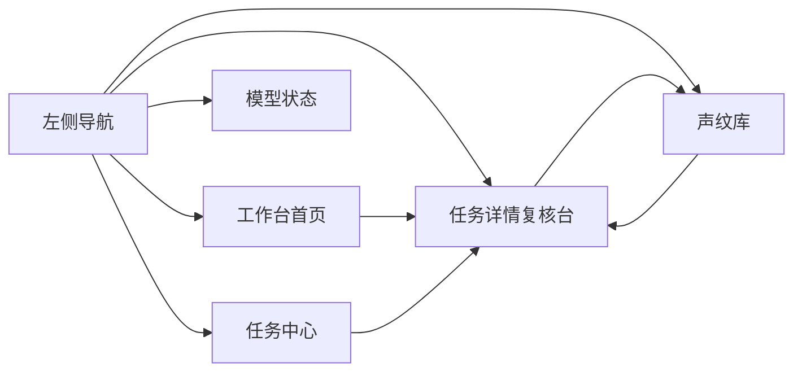
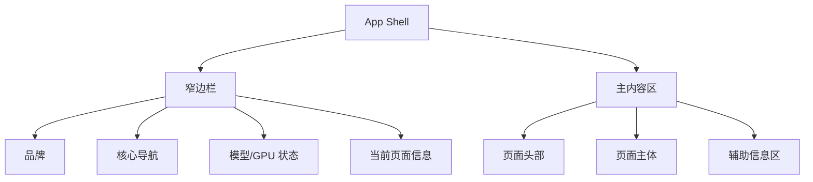

# Claude 风格前端重构设计

## 目标

本轮前端重构的目标不是单纯换皮，而是把当前偏后台面板式的界面，升级为更接近 Claude 网页版体验的极简工作台，同时保留 Voiceprint ASR Platform 自己的品牌识别。

设计目标分为四层：

1. 布局层：减少传统后台感，建立更安静、更聚焦的工作台骨架。
2. 品牌层：提取蓝青品牌图的视觉语言，而不是直接把海报贴进页面。
3. 排版层：强化标题、说明文本和结果文本区的阅读质量。
4. 页面层：让工作台、任务详情、声纹处理形成一条连续的工作流，而不是孤立页面。

## 约束

- 必须保留现有业务主链路和关键测试文案。
- 必须兼容当前 React + MUI 结构，不重建前端框架。
- 必须允许未来继续接入更强的说话人分离、热词、声纹结果回显。
- 必须兼顾桌面端和窄屏场景。
- 必须让生成和转写结果在前端里更容易直接查看。

## 参考来源

### Claude 网页版

主要借用以下特征：

- 左侧窄边栏与中央留白主工作区
- 极轻的边框和背景分层
- 高质量但低存在感的排版层级
- 聚焦单个主任务入口，而不是堆功能卡片

### 用户提供的品牌图

主要提取以下视觉语言：

- 蓝青渐变
- 圆角发光图标
- 声波与弧线结构
- 低噪声的科技感，而非大面积高饱和科技背景

### pretext 项目

`F:\1work\音频识别\pretext` 不是现成 UI 模板，而是文本测量与布局引擎。它对当前项目的价值不在于直接复用页面，而在于提供更稳定的多行文本排版能力。

本轮会把它的使用思路体现在：

- 主标题与副标题的平衡换行
- 长说明文案区的最大宽度与节奏控制
- 结果文本区的更稳定阅读布局

首轮不会强行把整个库打包进前端运行时，而是先按它的排版理念重构组件和文本容器。如果需要，再在后续版本把它真正引入到长文本测量组件。

## 设计方案

### 方案 A：Claude 式浅色极简工作台 + 蓝青品牌语言局部注入

这是本轮采用的方案。

优点：

- 与用户目标最一致
- 适合工作流型产品，而不是营销落地页
- 品牌感和可用性平衡最好
- 能容纳高密度转写、说话人、时间轴信息

缺点：

- 实现量较大
- 对排版细节和信息取舍要求高

### 方案 B：近似 Claude 的轻品牌复刻

优点：

- 风险低
- 易于统一

缺点：

- 品牌辨识度偏弱

### 方案 C：深色科技风品牌主视觉

优点：

- 冲击力强

缺点：

- 与“极简工作台”冲突
- 不适合长时间复核与阅读

## 信息架构

## 全局布局

### 布局原则

- 页面宽度更克制，主阅读区不无限拉伸。
- 大区域之间使用留白分隔，不依赖厚重卡片。
- 卡片只保留在真正需要边界的地方，例如上传区、speaker 信息区、任务摘要区。
- 主操作区始终有唯一视觉焦点。

## 品牌系统

### BrandLogo 设计

BrandLogo 使用代码重建，不直接嵌入用户海报图。

构成元素：

- 圆角方形容器
- 中央脉冲圆点
- 向上扩散的弧形声波
- 左右分布的音柱
- 蓝青渐变与轻发光描边

### 页面中的品牌使用强度

- 首页：中等强度，用于建立识别度
- 任务详情：弱使用，只保留轻量品牌线索
- 声纹库：弱到中等，用于身份与识别感
- 列表页/系统页：弱使用

## 排版系统

### 字体策略

- 中文正文：优先高可读无衬线
- 英文品牌和大标题：使用更有气质的衬线/准衬线组合
- 按钮、标签、状态文本：中等字重，避免太粗

### 文本容器策略

- 主标题限制最大宽度，保持 2 到 3 行内的平衡感
- 描述文字最大宽度固定，避免横向过宽
- speaker 文本摘要保持较高行高
- 长文本结果区使用更干净的段间距和段落边界

### 可读性公式

虽然前端不是算法排版引擎，但本轮会遵循下面的可读性约束：

\[
ReadableDensity = \frac{ContentWeight}{VisualNoise + LayoutFragmentation}
\]

本轮重构的核心就是降低：

- `VisualNoise`
- `LayoutFragmentation`

在不丢失关键信息的前提下提高 `ReadableDensity`。

## 页面级方案

### 1. 工作台首页

目标：让首页像真正的“开始工作”界面，而不是信息仪表盘。

结构：

- 主标题与问候区
- 主上传/提交卡片
- 最近任务轻列表
- 模型状态提示条
- 高级设置折叠区

保留内容：

- 高级设置
- 立即开始/新建任务
- GPU 状态
- 3D-Speaker / pyannote 状态提示

重构重点：

- 把当前深色 hero 改成浅色中心工作台
- 把模型状态从多块 Alert 收紧成更安静的信息提示
- 把“最近任务”从统计面板改成更轻的历史入口

### 2. 任务详情页

目标：变成真正的复核台。

结构：

- 顶部任务摘要
- 对齐时间线与 speaker timeline
- speaker 筛选区
- 可读结果流
- 右侧 speaker 信息与声纹动作

重构重点：

- 降低卡片数量
- 强化当前筛选 speaker 的上下文感
- 提升文本区阅读流
- 把导出、复制、快速重跑动作做得更轻

### 3. 声纹库页

目标：更像身份操作台。

结构：

- 当前上下文来源
- 识别/验证/注册主操作
- 档案列表与候选结果

本轮只会保持视觉风格统一，不会大幅改业务逻辑。

## 组件变更范围

### 必改

- `apps/web/src/theme/appTheme.ts`
- `apps/web/src/components/AppLayout.tsx`
- `apps/web/src/components/BrandLogo.tsx`
- `apps/web/src/components/PageSection.tsx`
- `apps/web/src/pages/transcription/TranscriptionWorkbenchPage.tsx`
- `apps/web/src/pages/jobs/JobDetailPage.tsx`

### 配套测试

- `apps/web/src/components/AppLayout.test.tsx`
- `apps/web/src/pages/transcription/TranscriptionWorkbenchPage.test.tsx`
- `apps/web/src/pages/jobs/JobDetailPage.test.tsx`

## 验收标准

### 视觉层

- 首页和任务详情一眼能看出从“后台系统”变成“极简工作台”
- 品牌感存在，但不喧宾夺主
- 字体、留白、边框、阴影明显更克制

### 交互层

- 现有主流程不变：上传 -> 创建任务 -> 查看结果 -> 对 speaker 做声纹处理
- 关键按钮、关键文案和主要测试路径不丢

### 工程层

- `pnpm test -- --run ...` 通过
- `pnpm typecheck` 通过
- 保持当前 Git 作者为用户身份

## 后续扩展

本轮完成后，后续可以继续：

1. 真正把 `pretext` 集成到长文本展示组件
2. 为 speaker 时间线加入更细的交互 hover 与跳转
3. 把首页工作台进一步做成多模式入口
4. 为声纹库加入更像身份目录的视觉层级
